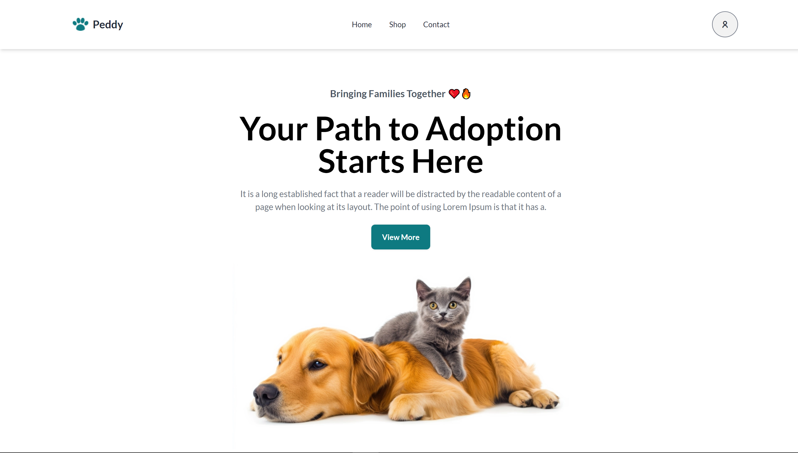

# 🐾 Peddy Adoption 🐾

**Peddy Adoption** is a platform where users can adopt their favorite pets! The website allows you to browse through pets, like them, and view detailed information, with a handy "sort by price" feature. It's fully responsive and built using modern web technologies, making it easy to use on any device.

---

## 🖼️ Screenshot

---

## ✨ Key Features
| Feature                         | Description                                      |
|----------------------------------|--------------------------------------------------|
| **Category-wise results**        | View pets sorted by categories like dogs or cats |
| **Like favorite pets**           | Save your favorite pets for later review         |
| **Detailed pet information**     | Get all info about each pet (age, breed, etc.)   |
| **Sort by price**                | Sort pets by price to find your best fit         |
| **Fully responsive**             | Optimized for all device sizes, from mobile to desktop |

---

## ⚙️ ES6 Features Used
- **Arrow functions** for cleaner and more concise function expressions.
- **Fetch API with `async`/`await`** for smooth handling of API requests.
- **Array sorting** to implement the "sort by price" feature for better user experience.

---

## 🚀 Live Link
Explore the project here: [**Peddy Adoption Live**](https://ph-assignment-6-peddy-adaption.netlify.app/) 🔗
